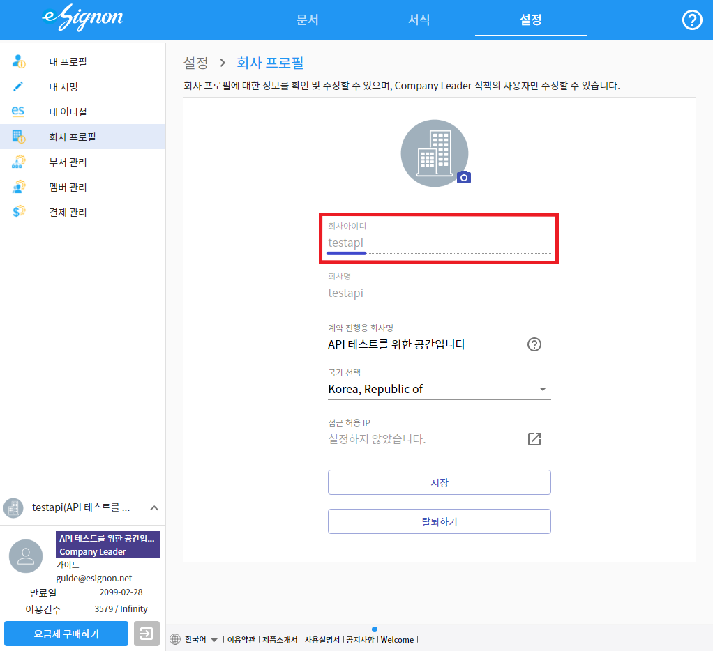

# API 설명

## <mark style="color:red;">**API 사이트가 개편되었습니다.**</mark>

### <mark style="color:red;">**아래 링크를통해 이동해주세요!!**</mark>&#x20;

### [**개편된 API 사이트로 이동하기 !!!!!!** ](https://developer.esignon.net) &#x20;


* eignon 의 API 는 Header - Body 형식 이며&#x20;
* Body 데이터 형식또한 프로토콜 코드와 version 관리를 위해 Header - Body 형식으로 제공합니다.
* 형식 ex) Header - Body ( Header - Body )
* 일부 API 의 경우 Body 의 형식이 다를 수 있습니다. 각 API의 설명을 참고해주시기 바랍니다.
* API 요금제 구입 문의는 [고객문의](https://esignon.net/customer/)를 이용 부탁드립니다.
* 사용순서 ) API회사 등록([고객문의](https://esignon.net/customer/)) -> 인증토큰 발급 -> 인증토큰을 이용하여 API 사용
* **`※Header 토큰 값 입력 형식을 꼭 지켜주세요※`**

## Ex) Header


Header 의 경우 최대 2개의 입력 값을 받으며 토큰 발급 API 를 제외한 모든 API는 Authorization에 토큰값을 입력해서 요청을 해야합니다. esignon 과 토큰 값 사이의 띄어쓰기 값이 필수적으로 입력되야 합니다.

## Ex) Body

```jsx
{
    "header": {
        Key : "value"
    },
    "body": {
        key : "value"
    }
}
```

Body 의 경우 request 시에 위 처럼 body안에 header 값과 body 의 key,value를 각각 작성하여 요청하여야합니다. 안에 들어가는 key,value의 예시는 각 API에 명 되어있습니다

## CompanyID&#x20;

companyId 의 경우 회사명이 아닌 회사 고유의 ID를 지칭합니다. 아래의 화면에서 확인가능합니다.



## API List

 **발급 API**

* [인증토큰 발급 ](https://api.esignon.net/issued/token)

 **문서 - 시작 API List**

* [비대면 계약 시작](https://api.esignon.net/workflow/start/nonfacestart)
* [비대면 계약 - ExportAPI](https://api.esignon.net/workflow/start/exportapi)
* [대량전송 계약 시](https://api.esignon.net/workflow/start/bulkstart)

 **문서 - 조회 API List**

* [문서 정보조회](https://api.esignon.net/workflow/view/workflowinfo)
* [특정필드 값으로 조회](https://api.esignon.net/workflow/view/readbyfiled)
* [기간으로 조회](https://api.esignon.net/workflow/view/readbydate)
* [진행 문서 목록조회](https://api.esignon.net/workflow/view/readallworkflow)
* [모든필드 값 조회](https://api.esignon.net/v/kor\_20210407/workflow/view/searchall) (구)

 **문서 - 상태변경 API List 및 기타 API List**

* [승인, 반려](https://api.esignon.net/workflow/modify/reject)
* [취소, 폐기, 삭제](https://api.esignon.net/workflow/modify/cancel)
* [문서 재전송](https://api.esignon.net/workflow/remind)
* [다운로드 URL 생성](https://api.esignon.net/v/kor\_20210407/workflow/downloadurl) (구)&#x20;

 **서식  API**

* [서식 정보조회 ](https://api.esignon.net/template/docinfo)
* [서식 목록조회](https://api.esignon.net/template/readdocument)

 **회사  API**

* [회사 정보조회](https://api.esignon.net/company/compinfo)
