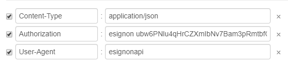

# API 설명


* esignon 의 API 는 Header - Body 형식 이며 
* Body 데이터 형식또한 프로토콜 코드와 version 관리를 위해 Header - Body 형식으로 제공합니다.
* 형식 ex\) Header - Body \( Header - Body \)
* 일부 API 의 경우 Body 의 형식이 다를 수 있습니다. 각 API의 설명을 참고해주시기 바랍니다.
* 이싸인온 API 사용시 회사 고유의 클라이언트 ID가 필요합니다.  
* 클라이언트 ID 발급은 [고객문의](https://esignon.net/wordpress/inquiry/)를 이용 부탁드립니다.

### Ex\) Header



Header 의 경우 최대 3개의 입력 값을 받으며 각 API 마다 받는 값의 종류의 차이가 있습니다.                                  이싸인온 토큰 값을 입력하는 Authorization 부분을 작성시엔                                                                         esignon 과 토근값 사이의 띄어쓰기 값이 필수적으로 입력되야 합니다.                        

### Ex\) Body

```text
{
	"header": {
		Key : "value"
	},
	"body": {
		key : "value"
	}
}
```

Body 의 경우 request 시에 위 처럼 body안에  header 값과 body 의 key,value를 각각 작성하여                                              요청하여야합니다. 안에 들어가는 key,value의 예시는 각 API의 설명에 자세히 설 되어있습니다

 See the Pen [API TEST](https://codepen.io/wodyd7654/pen/NWGmzmw) by wodyd7654 \([@wodyd7654](https://codepen.io/wodyd7654)\) on [CodePen](https://codepen.io).

