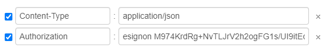

# API 설명

* esignon 의 API 는 Header - Body 형식 이며 
* Body 데이터 형식또한 프로토콜 코드와 version 관리를 위해 Header - Body 형식으로 제공합니다.
* 형식 ex\) Header - Body \( Header - Body \)
* 일부 API 의 경우 Body 의 형식이 다를 수 있습니다. 각 API의 설명을 참고해주시기 바랍니다.
* 이싸인온 API 사용시 회사 고유의 클라이언트 ID가 필요합니다.  
* 클라이언트 ID 발급은 [고객문의](https://esignon.net/customer/)를 이용 부탁드립니다.
* 사용순서 \) 클라이언트 ID 발급\(회사문의\) -&gt; 인증토큰 발급 -&gt; 인증토큰을 이용하여 API 사용
* **`※Header 토큰 값 입력 형식을 꼭 지켜주세요※`**

## Ex\) Header



Header 의 경우 최대 2개의 입력 값을 받으며 토큰 발급 API 를 제외한 모든 API는 Authorization에 토큰값을 입력해서 요청을 해야합니다. esignon 과 토큰 값 사이의 띄어쓰기 값이 필수적으로 입력되야 합니다.

## Ex\) Body

```jsx
{
    "header": {
        Key : "value"
    },
    "body": {
        key : "value"
    }
}
```

Body 의 경우 request 시에 위 처럼 body안에 header 값과 body 의 key,value를 각각 작성하여 요청하여야합니다. 안에 들어가는 key,value의 예시는 각 API에 명 되어있습니다

